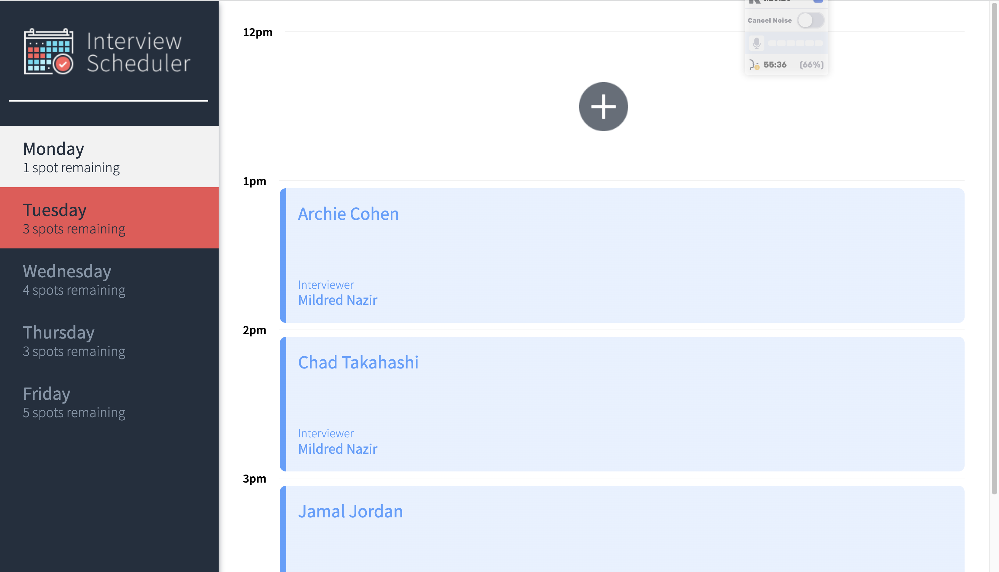
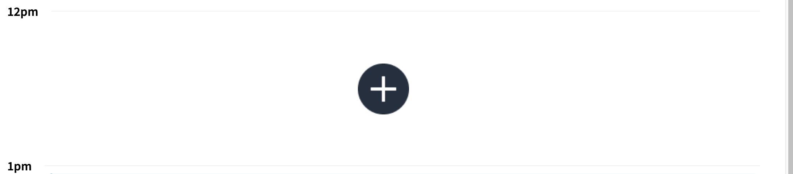
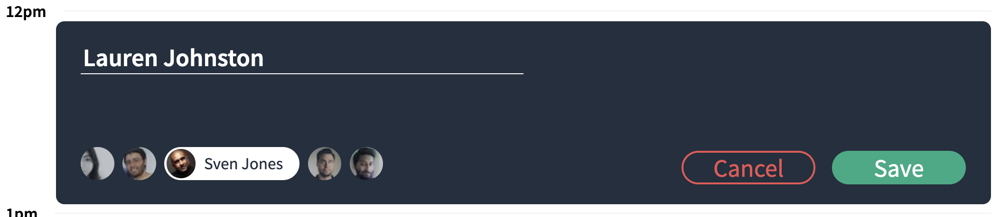
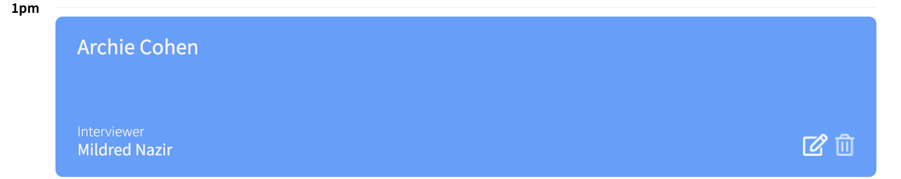
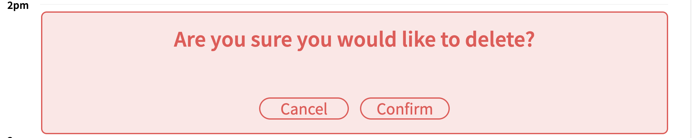
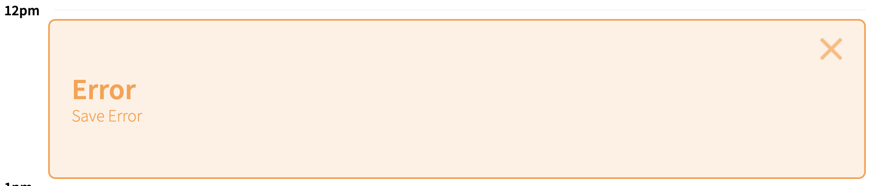

# Interview Scheduler

## Setup

Install dependencies with `npm install`.

## Running Webpack Development Server

```sh
npm start
```

## Running Jest Test Framework

```sh
npm test
```

## Running Storybook Visual Testbed

```sh
npm run storybook
```

## Walkthrough
#### Select Day:
Click on the day you would like to book/edit your appoimtnet using the left sidebar. The day you selected will show as "white" unless it is fully booked (the day will appear as a translucent white).


#### Select Appointment Time:
Any empty appointment slots have a '+' button. Click on this to book the interview.


#### Schedule Appointment:
Please fill in your name and select an interviewer. Once these mandatory fields are completed, you can save your appointment.


#### View Appointment:
Appointments that are successfully saved will be visible in the schedule on the right of the screen.

#### Edit Appoinment:
Hovering over an appointment will allow you to click the edit button and update the interviewer or the name.:


#### Delete Appointment:
Hovering over an appointment will allow you to click the delete button to remove the interview from view.


#### Error Messages:
If, for some reason, booking or saving an interview was not successful, you will see a yellow error message on the screen.
